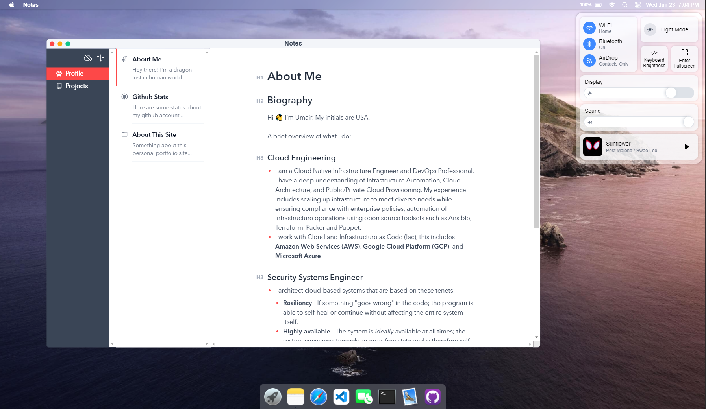
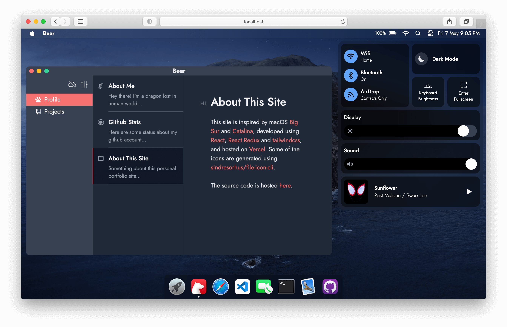

# MacOS Portfolio
My portfolio website simulating macOS's GUI

Powered by [React](https://reactjs.org/) + [React Redux](https://react-redux.js.org/) + [tailwindcss](https://tailwindcss.com/).





&nbsp;

## Usage

```bash
yarn install

# serve with hot reload, open http://localhost:3000 to view it in the browser
yarn dev

# build for production with minification to the `build` folder
yarn build
```
